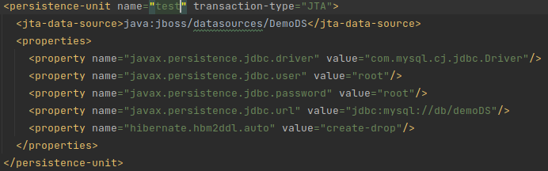
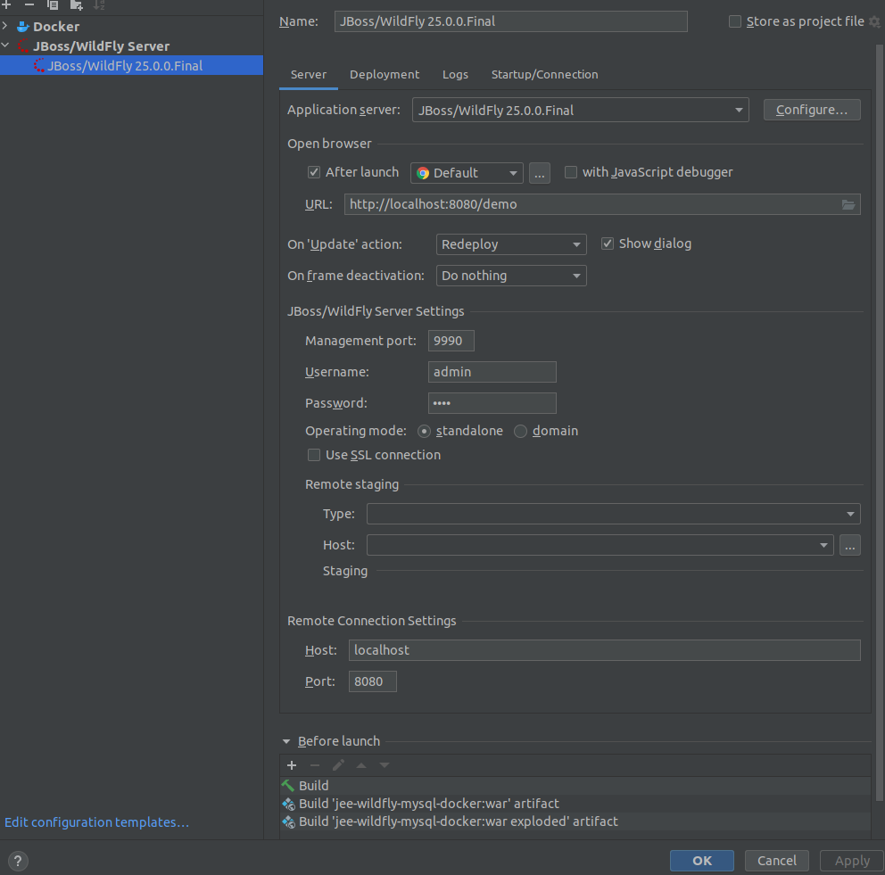
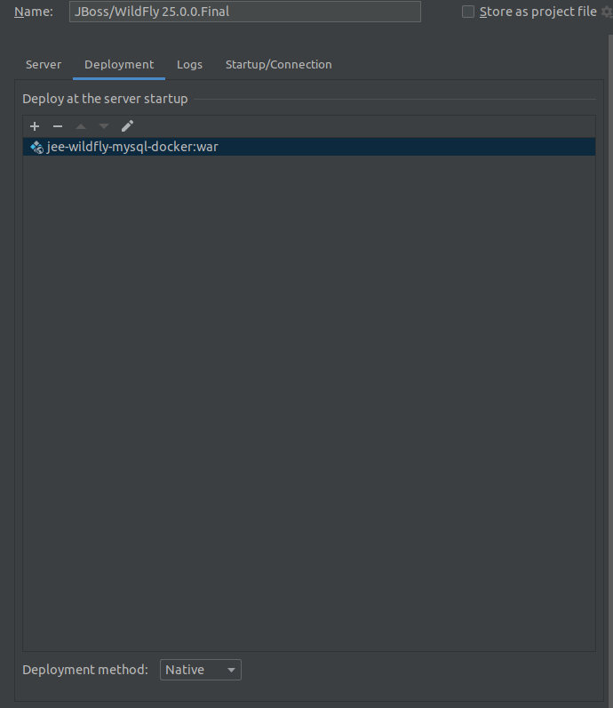

# jee-wildfly-mysql-docker

## docker-compose
config args for your project.
### Wildfly
- DB_NAME
- DB_USER
- DB_PASS
- DB_JNDI

make sure that in your persistence xml are the same parameters then in the 
docker-compose yml file

### Mysql
set the environment variables to your needs
please consider that:

- MYSQL_DATABASE
- MYSQL_USER
- MYSQL_PASSWORD

must be the same as the args from wildfly
- **MYSQL_DATABASE = DB_NAME**
- **MYSQL_USER = DB_USER**
- **MYSQL_PASSWORD = DB_PASS**

---
# Config Remote Wildfly 25 Final
## Server settings
- Add Jboss/Wildfly Server Settings with admin credentials
- Add Remote Connection Settings to 8080 port
- Add Before launch to war artifact

## Deployment settings
- Set Deployment method to Native

---
# Get Started

now you can remove all files until RestConfig.

in this project the url is localhost:8080/test/api/${your-endpoint-path} \
to change the /test/ url part go to pom and override the finalname to your habits. \
to change the /api/ url part go to RestConfig and change the ApplicatioinPath.

# ToolStack 
- docker-compose
- Wildfly 25.0.0.Final
- Mysql 8.0.28
- Java EE 8
